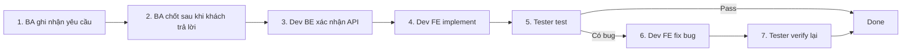

# Kịch bản mẫu: chạy thử 1 task qua PM/BA → Dev → Tester

Status: draft
Owner: PM/BA/DEV/TEST
Last reviewed: 2026-09-16
Related:
  - AGENTS.md
  - docs/ai/ba/ba-workflow.md
  - docs/ai/dev/dev-workflow.md
  - docs/ai/testing/tester-workflow.md
  - docs/workflows/api-contract-workflow.md
  - docs/workflows/feature-delivery-workflow.md
  - docs/requirements/change-log.md

## Mục đích

Kịch bản này dùng để **diễn tập** luồng làm việc với AI trong repo: một yêu cầu khách hàng đi từ PM/BA → Dev BE → Dev FE → Tester.

Sau khi chạy, team biết được:

- AI ở mỗi role có đọc đúng file workflow và làm đúng phạm vi không.
- Mỗi bước bàn giao có đủ output để role sau làm tiếp mà không cần hỏi lại.
- Chỗ nào trong tài liệu còn thiếu/mơ hồ cần sửa.

Task trong kịch bản là **ví dụ minh họa**. Thay `CU-DEMO-001`, nội dung yêu cầu, domain bằng task thật nếu muốn.

## Quy tắc khi chạy thử

- Mỗi role chạy trong **một session AI mới** (`/clear` hoặc mở chat mới). Không dùng chung session, nếu không AI sẽ "nhớ" ngữ cảnh và che mất lỗ hổng tài liệu.
- Chỉ đưa cho AI đúng prompt của bước đó. Không giải thích thêm luồng; nếu AI cần hỏi thì đó là dấu hiệu tài liệu thiếu → ghi vào [Nhật ký quan sát](#nhật-ký-quan-sát).
- Người chạy đóng vai "con người" ở mỗi role: trả lời open question, xác nhận API, duyệt PR.
- Chạy trên branch riêng, ví dụ `CU-DEMO-001-program-grade-filter`. Kết thúc có thể xóa branch nếu chỉ là diễn tập.
- Không ghi password/token/cookie vào bất kỳ output nào.

## Task mẫu

| Mục | Giá trị |
| --- | --- |
| ClickUp | `CU-DEMO-001` |
| Khách hàng yêu cầu | "Giáo viên muốn lọc danh sách chương trình học theo khối lớp, vì trường có nhiều chương trình trùng tên giữa các khối." |
| Nguồn | Có 2 biến thể, chọn 1: (a) email của khách ngày 2026-09-16 → có file request; (b) trao đổi qua điện thoại → chỉ ghi `Source: verbal: ...` |
| Domain dự kiến | `programs` |
| API liên quan | `GET /v1/programs` (param `grade_id`) trong `docs/api/programs/program.md` |

Lý do chọn: task nhỏ, có cả UI, API đã có sẵn trong swagger → đi đủ các bước nhưng không cần BE code mới.

## Tổng quan các bước



| Bước | Role | Trạng thái change-log trước → sau |
| --- | --- | --- |
| 1 | PM/BA | (chưa có) → `Draft` |
| 2 | PM/BA | `Draft` → `Ready for Dev` |
| 3 | Dev BE | `Ready for Dev` (API: `proposed` → `confirmed-by-BE`/`implemented`) |
| 4 | Dev FE | `Ready for Dev` → `In Dev` → `Ready for Test` |
| 5 | Tester | `Ready for Test` → `In Test` → `Done` hoặc quay lại Dev |
| 6–7 | Dev FE, Tester | Bug `open` → `fixed` → `verified` |

---

## Bước 1 – PM/BA: ghi nhận yêu cầu

Prompt:

```text
Bạn đóng vai BA. Đọc docs/ai/ba/ba-workflow.md.
Khách hàng yêu cầu: "Giáo viên muốn lọc danh sách chương trình học theo khối lớp, vì trường có nhiều chương trình trùng tên giữa các khối."
ClickUp: CU-DEMO-001. Nguồn: email của <tên khách> ngày 2026-09-16.
Phân loại yêu cầu, đọc requirement và code liên quan, tạo file request (nếu có minh chứng) và bản nháp requirement.
Liệt kê open questions cần hỏi khách. Không sửa code.
```

Output mong đợi:

| Output | Vị trí |
| --- | --- |
| File request (biến thể a) | `docs/requirements/requests/` |
| Requirement/change note nháp | `docs/requirements/programs/...` (feature mới hoặc change note vào file có sẵn) |
| Dòng change-log | `docs/requirements/change-log.md`, `Task = CU-DEMO-001`, `Status = Draft` |
| Open questions | Mục "Open questions" trong requirement + liệt kê trong câu trả lời |

Checklist:

- [ ] AI đọc `ba-workflow.md` và phân loại đúng (feature mới hay thay đổi requirement có sẵn).
- [ ] Tìm được requirement/tài liệu `programs` và `docs/api/programs/program.md` liên quan.
- [ ] Dùng đúng template trong `docs/ai/ba/templates/`.
- [ ] Có `Task: CU-DEMO-001` và `Source` đúng biến thể.
- [ ] Có business rule, AC dạng Given/When/Then, phân quyền (role nào thấy filter).
- [ ] Mục API: dùng lại API có sẵn (link `docs/api`) hoặc đề xuất ở trạng thái `proposed`.
- [ ] Không sửa file trong `src/`.

## Bước 2 – PM/BA: cập nhật sau khi khách trả lời

Người chạy tự trả lời open questions, ví dụ: "Filter chọn 1 khối; mặc định tất cả khối; áp dụng cho giáo viên và quản trị trường."

Prompt:

```text
Bạn đóng vai BA. Đọc docs/ai/ba/ba-workflow.md và <file requirement ở bước 1>.
Khách đã trả lời open questions: <nội dung>, ngày 2026-09-16, qua email.
Cập nhật requirement, customer confirmation, change-log. Kiểm tra Definition of Done để chuyển Ready for Dev.
```

Checklist:

- [ ] Open questions được điền câu trả lời + ngày/kênh.
- [ ] Mục "Customer confirmation" có người xác nhận.
- [ ] AI tự kiểm DoD; nếu API còn `proposed` thì nói rõ cần Dev BE xác nhận trước (hoặc cho phép FE làm song song với mock).
- [ ] Change-log chuyển `Ready for Dev` (hoặc giải thích vì sao chưa).

## Bước 3 – Dev BE: xác nhận API

Bỏ qua nếu requirement chỉ dùng API đã `implemented`.

Prompt:

```text
Bạn đóng vai Dev BE. Đọc docs/workflows/api-contract-workflow.md.
Review mục "API đề xuất cho BE" và "Phân quyền đề xuất" trong <file requirement>.
Liệt kê điểm cần đổi so với đề xuất; sau khi tôi xác nhận, ghi trạng thái confirmed-by-BE và dòng xác nhận. Không sửa code FE.
```

Checklist:

- [ ] AI đối chiếu đề xuất với `docs/api/programs/program.md`.
- [ ] Liệt kê khác biệt (tên param, kiểu, lỗi) trước khi ghi trạng thái.
- [ ] Chỉ ghi `confirmed-by-BE` sau khi người chạy xác nhận.
- [ ] Không sửa `src/`, không sửa nghiệp vụ trong requirement.

**Tình huống thử thêm (tùy chọn):** Đưa cho AI một swagger mới rồi dùng prompt "Dev BE sinh lại tài liệu API" trong `dev-workflow.md`. Kiểm tra AI báo endpoint thêm/xóa/đổi và cập nhật `implemented`.

## Bước 4 – Dev FE: implement

**Thử điều kiện chặn trước (khuyến nghị):** chạy prompt dưới đây khi change-log còn `Draft`. AI phải **dừng** và báo thiếu điều kiện, không code.

Prompt:

```text
Bạn đóng vai Dev FE. Đọc AGENTS.md và docs/ai/dev/dev-workflow.md.
Implement task CU-DEMO-001 theo requirement được link trong docs/requirements/change-log.md.
Kiểm tra điều kiện bắt đầu trước khi code. Sau khi sửa, chạy type check/lint, cập nhật tài liệu liên quan và soạn mô tả PR theo template.
```

Output mong đợi:

| Output | Vị trí |
| --- | --- |
| Code | `src/` (màn danh sách chương trình, API params, i18n) |
| Text UI | `messages/vi.json`, `messages/en.json` |
| Mô tả PR | Trong câu trả lời, theo template Bước 7 của `dev-workflow.md` |
| Change-log | `In Dev` → `Ready for Test` (sau khi người chạy xác nhận đã merge/deploy) |

Checklist:

- [ ] Kiểm tra điều kiện bắt đầu và nêu kết quả trước khi code.
- [ ] Đọc code theo thứ tự trong `AGENTS.md`, dùng lại `ProgramListParams`/API có sẵn thay vì tạo mới.
- [ ] Mỗi AC có phần code tương ứng; bảng AC trong PR đầy đủ.
- [ ] Có i18n `vi` và `en`.
- [ ] Đã chạy `pnpm exec tsc --noEmit` và `pnpm exec eslint <files>`, ghi kết quả.
- [ ] Mục "Cách test nhanh" có môi trường test đề xuất (Local/Public), route, role/username (không password), các bước.
- [ ] Mục "Tài liệu" nêu file đã cập nhật hoặc lý do không cập nhật.
- [ ] Không sửa `package.json`, `.env`, config.

## Bước 5 – Tester: test task

Đưa mô tả PR ở bước 4 cho Tester (dán vào prompt hoặc lưu tạm file).

Prompt:

```text
Bạn đóng vai Tester. Đọc docs/ai/testing/tester-workflow.md.
Test task CU-DEMO-001 theo requirement được link trong docs/requirements/change-log.md và mô tả PR sau: <mô tả PR>.
Môi trường test: <Local | Public>.
Viết test case vào docs/test-cases/<domain>/, chạy test (manual qua app hoặc Playwright nếu phù hợp),
ghi test report và bug report (nếu có). Không sửa source code.
```

Output mong đợi:

| Output | Vị trí |
| --- | --- |
| Test case | `docs/test-cases/programs/<feature>.md` |
| Test report | `docs/test-cases/programs/reports/` |
| Bug report (nếu có) | `docs/test-cases/programs/bugs/` |
| E2E (nếu automation) | `tests/e2e/programs/` |
| Change-log | `In Test` → `Done` hoặc ghi bug quay lại Dev |

Checklist:

- [ ] Test case map với từng AC (và business rule), có case âm/biên (không chọn khối, khối không có chương trình, đổi trang).
- [ ] Kiểm tra quyền theo role trong requirement.
- [ ] Test data/account lấy từ `docs/testing/test-data.md`, không in password.
- [ ] Bug report có steps/expected/actual, expected trích từ requirement, có `CU-...`.
- [ ] Chạy đúng nhánh môi trường: Local (`http://localhost:3000`) nếu PR chưa merge/deploy, Public (`https://dev.xlms.vn`) nếu đã deploy `develop`.
- [ ] Test report có nhánh môi trường, Web URL, branch/commit, kết quả từng case.
- [ ] Không sửa `src/`.

**Tình huống thử thêm (tùy chọn):** trước bước 5, cố ý để Dev FE thiếu i18n `en` hoặc bỏ 1 AC. Tester phải phát hiện và ghi bug.

## Bước 6 – Dev FE: fix bug (nếu có)

```text
Bạn đóng vai Dev FE. Đọc AGENTS.md và docs/ai/dev/dev-workflow.md.
Fix bug docs/test-cases/programs/bugs/<BUG-ID>.md (ClickUp CU-DEMO-001).
Đối chiếu expected với requirement, sửa code, cập nhật bug report và change-log, soạn mô tả PR.
```

Checklist:

- [ ] Đối chiếu expected với requirement trước khi sửa; nếu requirement không mô tả thì báo PM/BA.
- [ ] Bug report chuyển `fixed`, có branch/commit.

## Bước 7 – Tester: verify bug

```text
Bạn đóng vai Tester. Đọc docs/ai/testing/tester-workflow.md.
Verify bug docs/test-cases/programs/bugs/<BUG-ID>.md.
Môi trường test: <Local | Public>.
Kiểm tra đã fix chưa, fix nằm ở branch nào, còn bug liên quan không. Cập nhật bug report và test report. Không sửa source code.
```

Checklist:

- [ ] Bug chuyển `verified` hoặc `reopened` kèm bằng chứng, ghi rõ nhánh môi trường đã verify.
- [ ] Chạy lại regression các case liên quan.
- [ ] Change-log `Done` khi không còn bug chặn.

---

## Tiêu chí đánh giá luồng

Luồng được coi là **đạt** khi:

- [ ] Không bước nào AI phải hỏi lại điều đã có trong tài liệu.
- [ ] Mỗi role chỉ sửa file trong phạm vi của mình.
- [ ] Output của bước trước đủ để bước sau chạy chỉ với prompt mẫu.
- [ ] Dòng change-log phản ánh đúng trạng thái sau từng bước.
- [ ] Truy vết được: `CU-DEMO-001` → request → requirement → AC → PR → test case → test report/bug.

## Nhật ký quan sát

Ghi trong lúc chạy; cuối buổi dùng bảng này để sửa tài liệu workflow.

| Bước | Role | Hiện tượng (AI làm gì sai/hỏi gì/bỏ bước nào) | Nguyên nhân nghi ngờ (file docs nào thiếu/mơ hồ) | Đề xuất sửa | Mức độ (Chặn/Nên sửa/Nhỏ) |
| --- | --- | --- | --- | --- | --- |
| 1 | PM/BA |  |  |  |  |
| 2 | PM/BA |  |  |  |  |
| 3 | Dev BE |  |  |  |  |
| 4 | Dev FE |  |  |  |  |
| 5 | Tester |  |  |  |  |
| 6 | Dev FE |  |  |  |  |
| 7 | Tester |  |  |  |  |

## Dọn dẹp sau diễn tập

Nếu `CU-DEMO-001` chỉ là task giả:

- Xóa file request/requirement/test case/report/bug có `CU-DEMO-001`.
- Xóa dòng `CU-DEMO-001` trong `change-log.md`.
- Xóa branch diễn tập; không merge vào `develop`.
- Giữ lại bảng nhật ký quan sát (copy ra ngoài) để sửa tài liệu.
