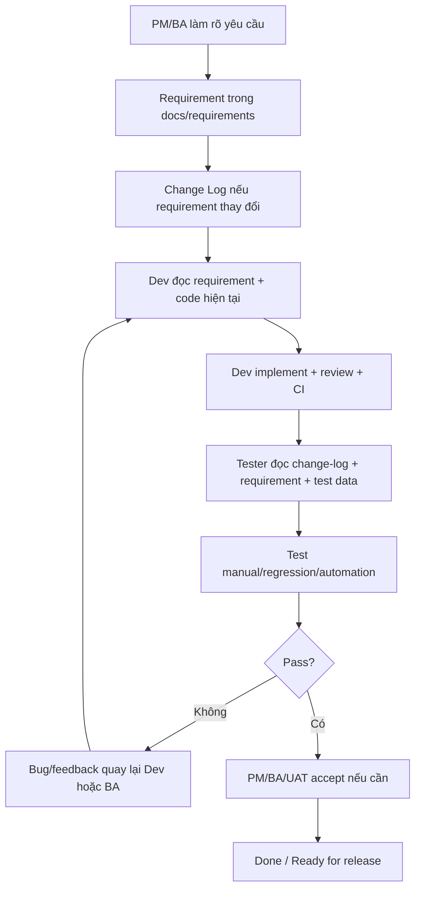

# Tổng quan sử dụng AI trong dự án LMSX

Status: draft
Owner: BA/PM/DEV/TEST
Related:
  - AGENTS.md
  - CLAUDE.md
  - README.md
  - docs/ai/reading-guide.md
  - docs/ai/documentation-structure.md
  - docs/workflows/feature-delivery-workflow.md
  - docs/requirements/change-log.md
  - docs/requirements/change-workflow.md
  - docs/testing/test-automation-workflow.md

## Mục đích

Tài liệu này là bản tổng quan để gửi cho team khi bắt đầu dùng AI trong repo.

Sau khi đọc, mọi người cần hiểu:

- Folder `docs/` dùng để làm gì.
- BMad là gì và dùng ở đâu trong luồng làm việc.
- Một task/chức năng đi từ PM/BA -> Dev -> Test như thế nào.
- Khi requirement thay đổi thì cần cập nhật tài liệu nào để tester biết scope.
- Nên prompt AI như thế nào để AI đọc đúng ngữ cảnh, không tự suy diễn.

## Bức tranh tổng quan



AI hỗ trợ ở từng bước, nhưng không thay team quyết định nghiệp vụ, chất lượng code hoặc kết quả test.

## Folder `docs/` dùng để làm gì?

`docs/` là nơi lưu ngữ cảnh để con người và AI cùng hiểu hệ thống.

Không có `docs/`, AI thường phải đoán từ code hoặc từ prompt ngắn. Khi có `docs/`, AI có thể đọc requirement, API, quyền, test data và workflow trước khi trả lời hoặc sửa code.

Các folder quan trọng:

| Folder | Dùng để làm gì | Ai dùng nhiều |
| --- | --- | --- |
| `docs/ai/` | Hướng dẫn cách dùng AI, prompt, reading guide, workflow AI | BA/Dev/Test/AI |
| `docs/workflows/` | Luồng làm việc chung của team | PM/BA/Dev/Test |
| `docs/requirements/` | Requirement, business rule, flow nghiệp vụ theo domain | PM/BA/Dev/Test |
| `docs/design/` | Ghi chú UI/UX, screen behavior, interaction | UX/Dev/Test |
| `docs/api/` | API contract, endpoint, request/response | Dev/Test |
| `docs/security/` | RBAC, role, permission, resource/action | BA/Dev/Test |
| `docs/testing/` | Môi trường test, test data, automation workflow | Test/Dev |
| `docs/test-cases/` | Test case manual/regression theo feature | Test |

Nguyên tắc quan trọng:

- Tài liệu liên quan trực tiếp trong `docs/` được ưu tiên hơn code khi hai bên mâu thuẫn: tài liệu là hành vi kỳ vọng, code là hiện trạng triển khai. Điểm lệch phải được ghi rõ.
- Requirement trong `docs/requirements/` là nơi mô tả nghiệp vụ hiện tại.
- Khi thay đổi requirement, phải cập nhật `docs/requirements/change-log.md` để tester biết file nào đã đổi.
- Test case cụ thể đặt trong `docs/test-cases/`, không đặt lẫn vào `docs/testing/`.

## AGENTS.md và CLAUDE.md là gì?

`AGENTS.md` là hướng dẫn làm việc cho AI coding agent trong repo này.

File này nói cho AI biết:

- Repo là frontend Next.js của LMSX.
- Nên đọc code theo thứ tự nào.
- Khi code và docs lệch nhau thì ưu tiên nguồn nào.
- Quy tắc sửa code theo khu vực.
- Những anti-pattern cần tránh.
- Kỳ vọng khi chạy kiểm tra và báo kết quả.

`CLAUDE.md` là file bridge cho Claude Code. File này trỏ về `AGENTS.md` để Claude cũng dùng cùng một source of truth.

Quy ước của repo:

```text
AGENTS.md  -> source of truth chung cho AI coding agents
CLAUDE.md  -> bridge cho Claude Code, trỏ về AGENTS.md
```

Không nên copy toàn bộ `AGENTS.md` sang `CLAUDE.md`, vì sau này hai file dễ bị lệch.

## BMad là gì?

BMad là bộ workflow/skill giúp AI làm việc có quy trình hơn thay vì chỉ hỏi đáp rời rạc.

Trong repo này, BMad hỗ trợ các nhóm việc chính:

- Lập product brief, PRD, spec.
- Thiết kế architecture.
- Tạo epics/stories.
- Kiểm tra sprint readiness.
- Build/implement.
- Code review.
- Tạo QA automation.
- Thiết kế test, setup test framework, test automation, traceability.

BMad không phải là một công cụ thay thế PM/BA/Dev/Test. Nó là bộ quy trình để AI hỏi đúng câu hỏi, đọc đúng nguồn và tạo output có cấu trúc.

## BMad nằm ở đâu trong repo?

Các file BMad chính:

| Path | Ý nghĩa |
| --- | --- |
| `_bmad/_config/bmad-help.csv` | Catalog workflow/skill BMad đang có trong repo |
| `_bmad/config.toml` | Config BMad của project |
| `_bmad-output/` | Nơi BMad workflow ghi output mặc định. Folder bị gitignore nên chỉ là nháp cục bộ; kết quả chính thức phải ghi vào `docs/` hoặc `tests/` |
| `_bmad/custom/` | Override của team cho BMad skill (ví dụ buộc skill test đọc `docs/ai/testing/tester-workflow.md`) |
| `.agents/skills/` | Skill cục bộ được cài cho agent |

Khi cần xem repo có workflow nào, đọc:

```text
_bmad/_config/bmad-help.csv
```

## Khi nào dùng BMad skill nào?

| Nhu cầu | Skill gợi ý |
| --- | --- |
| Hỏi BMad nên làm gì tiếp | `bmad-help` |
| Viết/cập nhật PRD | `bmad-prd` |
| Tạo spec ngắn từ ý tưởng/tài liệu | `bmad-spec` |
| Thiết kế architecture | `bmad-architecture` |
| Tạo epics/stories | `bmad-create-epics-and-stories` |
| Kiểm tra sprint readiness | `bmad-sprint-planning` |
| Implement feature/bug fix | `bmad-build` |
| Review code | `bmad-code-review` hoặc `bmad-review` |
| Tạo QA automation sau khi build | `bmad-qa-generate-e2e-tests` |
| Thiết kế test plan theo risk | `bmad-testarch-test-design` |
| Setup Playwright/Cypress/API test framework | `bmad-testarch-framework` |
| Mở rộng automation coverage | `bmad-testarch-automate` |
| Review chất lượng test | `bmad-testarch-test-review` |
| Trace requirement -> test -> result | `bmad-testarch-trace` |

Nếu chưa biết bắt đầu từ đâu, hỏi AI:

```text
Dựa trên repo này, hãy dùng bmad-help để đề xuất workflow tiếp theo cho task sau: ...
```

## Luồng đi của một task/chức năng

Luồng chuẩn nằm trong:

```text
docs/workflows/feature-delivery-workflow.md
```

Tóm tắt:

1. PM/BA làm rõ yêu cầu.
2. PM/BA viết hoặc cập nhật requirement.
3. Nếu requirement thay đổi, cập nhật `docs/requirements/change-log.md`.
4. Dev đọc requirement và code hiện tại.
5. Dev implement, tự kiểm tra, tạo PR.
6. Code review/CI.
7. Deploy hoặc chuẩn bị môi trường test.
8. Tester đọc change log, requirement, test data.
9. Tester test manual/regression/automation.
10. Bug quay lại Dev hoặc BA.
11. Pass thì PM/BA/UAT accept nếu cần.
12. Done/Ready for release.

## Khi requirement thay đổi thì làm gì?

Đọc:

```text
docs/requirements/change-workflow.md
docs/requirements/change-log.md
```

Quy tắc nhanh:

- Thay đổi nhỏ trên chức năng cũ: cập nhật file requirement cũ.
- Thay đổi lớn/flow mới/proposal riêng: tạo file mới và link về requirement chính.
- Mọi thay đổi requirement đều cần thêm dòng vào `docs/requirements/change-log.md`.

Tester sẽ bắt đầu từ `change-log.md`, nên nếu quên cập nhật file này thì tester rất dễ không biết scope test.

## Test automation bằng AI đi theo luồng nào?

Đọc:

```text
docs/testing/test-automation-workflow.md
```

Tóm tắt:

1. Xác định feature/task cần test.
2. Đọc `docs/requirements/change-log.md`.
3. Đọc requirement, API, security, test data.
4. Xác định test impact: manual, regression, automation.
5. Dùng BMad/AI để tạo test design hoặc test automation.
6. Tester review lại test code.
7. Chạy test, debug, lưu evidence.
8. Map requirement -> test case -> automation -> result nếu cần traceability.

Với web frontend, Playwright là lựa chọn tự nhiên cho E2E/UI automation. Nhưng BMad workflow không có nghĩa là framework đã setup hoàn chỉnh. Dev/Test vẫn cần kiểm tra `package.json`, config test và script chạy test.

## Source of truth khi AI làm việc

Khi thông tin mâu thuẫn, ưu tiên:

1. Tài liệu liên quan trực tiếp trong `docs/` — ưu tiên tài liệu gần feature hơn tài liệu tổng quan.
2. Code đang chạy trong repo.
3. Type, API module, constant, route, schema gần feature.
4. Test, story, usage thật.
5. Comment cũ hoặc suy luận của AI.

Tài liệu mô tả hành vi **kỳ vọng**; code là **hiện trạng triển khai**. Khi hai bên lệch nhau:

- Task kiểm tra/review/test: lấy tài liệu làm expected result, báo rõ điểm lệch (có thể là bug).
- Task sửa/implement: chỉnh code theo tài liệu.
- Ngoại lệ: tài liệu có `Status: generated` (kiểm tra `Source`), `needs-review`, `outdated`, mơ hồ hoặc mâu thuẫn với tài liệu khác → không tự bỏ qua, nêu rõ giả định và hỏi lại người phụ trách.

Nguồn chuẩn của quy tắc này là `AGENTS.md`.

AI phải nói rõ khi đang suy luận hoặc khi tài liệu chưa đủ bằng chứng.

## Cách prompt AI tốt hơn

Prompt nên có đủ:

- Vai trò AI cần đóng: BA, Dev, Tester, Reviewer.
- Task cần làm.
- File cần đọc.
- Output mong muốn.
- Điều kiện không được tự suy diễn.

Ví dụ cho BA:

```text
Bạn đóng vai BA. Hãy đọc docs/ai/ba/ba-workflow.md và requirement hiện tại của lecture.
Khách hàng yêu cầu đổi rule preview lecture khi video lỗi. ClickUp: CU-86c1ab2de. Nguồn: email ngày 2026-09-16 (có minh chứng).
Tạo file request, đề xuất cập nhật file cũ hay tạo change note, viết acceptance criteria, API/quyền đề xuất cho BE nếu cần, test impact và open questions.
Không sửa code, không tự chốt API thay BE.
```

Ví dụ cho Dev:

```text
Bạn đóng vai Dev FE. Hãy đọc AGENTS.md, docs/ai/dev/dev-workflow.md và requirement được link trong docs/requirements/change-log.md.
Implement task CU-86c1ab2de. Kiểm tra điều kiện bắt đầu trước khi code.
Trước khi sửa, hãy xác định data flow: route -> component -> hook/store -> API/type.
Sau khi sửa, chạy type check/lint, cập nhật tài liệu liên quan và soạn mô tả PR theo template.
```

Ví dụ cho Dev BE:

```text
Bạn đóng vai Dev BE. Hãy đọc docs/workflows/api-contract-workflow.md.
Review mục API và phân quyền đề xuất trong docs/requirements/<domain>/<file>.md cho task CU-86c1ab2de.
Liệt kê điểm cần đổi; sau khi thống nhất với BA, ghi trạng thái confirmed-by-BE và dòng xác nhận.
```

Ví dụ cho Tester:

```text
Bạn đóng vai Tester. Hãy đọc docs/ai/testing/tester-workflow.md, docs/requirements/change-log.md, requirement liên quan và docs/testing/test-data.md.
Tạo test scenarios cho task CU-86c1ab2de, phân loại Manual/Regression/Automation.
Ghi test case vào docs/test-cases/<domain>/. Nếu thiếu dữ liệu hoặc requirement mơ hồ, ghi rõ needs-review.
Không sửa source code.
```

Ví dụ cho Tester verify bug:

```text
Bạn đóng vai Tester. Hãy đọc docs/ai/testing/tester-workflow.md.
Verify bug: "<mô tả bug>". Môi trường test: <Local | Public>.
Kiểm tra đã fix chưa, fix nằm ở branch nào, còn bug liên quan không.
Ghi test case, bug report, test report vào docs/test-cases/<domain>/. Không sửa source code.
```

Ví dụ cho automation:

```text
Hãy tạo Playwright E2E test cho feature lecture preview.
Môi trường test: <Local | Public>.
Đọc docs/testing/test-automation-workflow.md, requirement lecture, route và component liên quan.
Không hard-code password.
Nếu repo chưa có Playwright config/script, đề xuất thay đổi tối thiểu cần thêm.
```

## Team nên bắt đầu từ đâu?

Nếu bạn là PM/BA:

1. Đọc `docs/ai/ba/ba-workflow.md` (ghi nhận yêu cầu khách, phân loại, template, ClickUp Task ID, DoD trước Ready for Dev).
2. Đọc `docs/workflows/feature-delivery-workflow.md`.
3. Với thay đổi chức năng đã có, đọc `docs/requirements/change-workflow.md`.
4. Mọi thay đổi requirement đều cập nhật `docs/requirements/change-log.md` với ClickUp Task ID và Source.

Nếu bạn là Dev FE:

1. Đọc `AGENTS.md` và `docs/ai/dev/dev-workflow.md`.
2. Kiểm tra điều kiện bắt đầu: change-log `Ready for Dev`, API `confirmed-by-BE`.
3. Đọc requirement/change-log được link từ task, rồi code gần feature trước khi sửa.
4. Tạo PR theo template, cập nhật tài liệu liên quan.

Nếu bạn là Dev BE:

1. Đọc `docs/workflows/api-contract-workflow.md`.
2. Review và xác nhận API/quyền đề xuất trong requirement.
3. Sau khi deploy, sinh lại `docs/api/`, `docs/security/` và đổi trạng thái `implemented`.

Nếu bạn là Tester:

1. Đọc `docs/ai/testing/tester-workflow.md` (phân loại task, output bắt buộc, Definition of Done).
2. Đọc `docs/requirements/change-log.md`.
3. Đọc requirement/API/security/test data liên quan.
4. Tạo hoặc cập nhật test case, bug report, test report trong `docs/test-cases/<domain>/`.
5. Nếu làm automation, theo `docs/testing/test-automation-workflow.md`.

Nếu bạn dùng Claude Code:

1. Đọc `CLAUDE.md`.
2. Claude sẽ được trỏ về `AGENTS.md`.
3. Khi prompt Claude, vẫn nên nêu rõ file docs/task cần đọc.

## Những lỗi dễ gặp khi dùng AI

- Chỉ đưa prompt ngắn, không cho AI đọc file liên quan.
- Để requirement thay đổi trong chat/ticket nhưng không cập nhật `docs/requirements/change-log.md`.
- Tin AI khi AI suy luận từ tên file mà chưa đọc code.
- Copy test automation AI sinh ra mà không review selector, data, assertion.
- Tạo tài liệu mới cho mọi task nhỏ làm source of truth bị phân mảnh.
- Không ghi rõ phần nào là giả định hoặc cần BA/Dev/Test review.

## Checklist trước khi nhờ AI làm task

- Task có link requirement hoặc mô tả đủ rõ chưa?
- Nếu là thay đổi chức năng cũ, `docs/requirements/change-log.md` đã có dòng tương ứng chưa?
- Có biết role/user bị ảnh hưởng không?
- Có biết route/component/API liên quan không?
- Có test data/account không?
- Có output mong muốn rõ không: doc, code, test case, automation, review?
- Có yêu cầu AI ghi rõ giả định và câu hỏi còn mở không?

## Tài liệu nên đọc tiếp

- `docs/ai/reading-guide.md`: AI nên đọc gì theo từng vai trò.
- `docs/ai/documentation-structure.md`: cấu trúc folder `docs/`.
- `docs/workflows/feature-delivery-workflow.md`: luồng PM/BA -> Dev -> Test.
- `docs/requirements/change-workflow.md`: cách xử lý requirement khi task mới thay đổi chức năng cũ.
- `docs/requirements/change-log.md`: danh sách requirement đã thay đổi.
- `docs/testing/test-automation-workflow.md`: workflow test automation bằng AI/BMad.
- `docs/ai/dev/dev-workflow.md`: điểm vào cho AI Dev FE/BE.
- `docs/workflows/api-contract-workflow.md`: PM/BA/Dev BE chốt API và phân quyền, sinh lại `docs/api/`, `docs/security/`.
- `docs/ai/ba/ba-workflow.md`: điểm vào cho AI PM/BA, từ yêu cầu khách hàng đến Ready for Dev.
- `docs/ai/testing/tester-workflow.md`: điểm vào cho AI Tester, gồm verify bug/security finding.
- `docs/ai/testing/test-case-generation.md`: cách tạo test case từ requirement.
