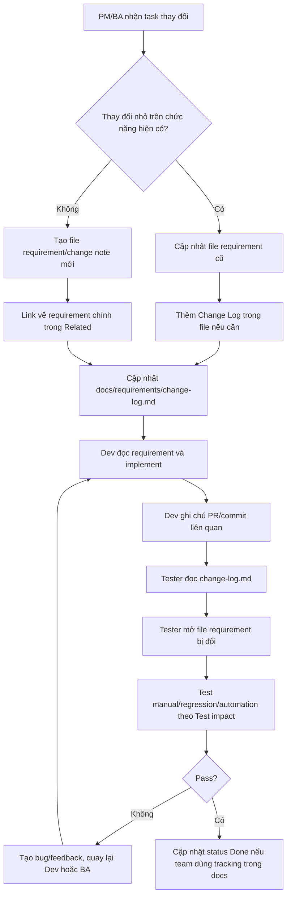

# Requirement Change Workflow

Status: draft
Owner: BA/PM/DEV/TEST
Related:
  - docs/workflows/feature-delivery-workflow.md
  - docs/requirements/change-log.md
  - docs/ai/ba/ba-workflow.md
  - docs/ai/ba/templates/change-note.md
  - docs/requirements/overview.md
  - docs/testing/test-automation-workflow.md
  - docs/ai/testing/test-case-generation.md

## Mục đích

Tài liệu này mô tả cách xử lý requirement khi một task mới thay đổi chức năng đã tồn tại.

Mục tiêu:

- PM/BA biết khi nào sửa file requirement cũ, khi nào tạo file mới.
- Dev biết requirement nào là source of truth cho task.
- Tester biết file nào đã thay đổi và cần test lại phần nào.
- AI agent có quy ước thống nhất khi đọc, sửa và tạo tài liệu.

Tài liệu này áp dụng cho yêu cầu loại B (thay đổi chức năng đã có) trong `docs/ai/ba/ba-workflow.md`. Feature mới hoàn toàn (loại A) dùng template `docs/ai/ba/templates/feature-requirement.md`. Cách ghi nhận yêu cầu khách hàng và ClickUp Task ID xem `docs/ai/ba/ba-workflow.md`.

## Quy tắc quyết định file cũ hay file mới

### Viết vào file requirement cũ

Dùng khi task chỉ thay đổi hành vi của một chức năng đã tồn tại.

Ví dụ:

- Đổi rule hiển thị.
- Thêm field nhỏ.
- Đổi validation.
- Đổi permission.
- Sửa một đoạn trong flow hiện tại.
- Thêm trạng thái loading, empty hoặc error.
- Đổi text nghiệp vụ.

Khi viết vào file cũ, vẫn phải thêm dòng vào `docs/requirements/change-log.md` để tester biết file đó đã đổi.

### Tạo file mới

Dùng khi task là một thay đổi lớn hoặc có thể đọc độc lập.

Ví dụ:

- Thêm flow lớn.
- Thêm module con mới.
- Refactor nghiệp vụ ảnh hưởng nhiều màn.
- Epic riêng.
- Thay đổi cần rollout/migration.
- Thay đổi đang là proposal, chưa muốn nhập ngay vào requirement chính.
- Experiment hoặc A/B test.

File mới phải link về file requirement chính trong phần `Related`.

Sau khi thay đổi đã chốt và code đã merge, BA/PM nên đồng bộ lại phần ổn định vào file requirement chính để người đọc sau này không phải ghép thông tin từ quá nhiều file.

### Bug fix và security finding

Dùng khi task là sửa lỗi hoặc xử lý finding bảo mật, không phải thay đổi nghiệp vụ.

- Nếu requirement hiện tại đã mô tả đúng hành vi: không sửa requirement, chỉ thêm dòng `change-log.md` với `Change type = Bug fix` hoặc `Security fix`, link bug report.
- Nếu requirement chưa mô tả hành vi đúng (ví dụ chưa có rule "không lưu mật khẩu ở client"): BA bổ sung business rule vào file requirement domain, rồi thêm dòng `change-log.md`.
- Bug report đặt trong `docs/test-cases/<domain>/bugs/`. Luồng đầy đủ xem mục "Luồng bug fix và security finding" trong `docs/workflows/feature-delivery-workflow.md`.

## Flow tổng quan



## Trách nhiệm theo vai trò

### PM/BA

PM/BA chịu trách nhiệm làm rõ thay đổi requirement.

Checklist:

- Xác định task là update file cũ hay tạo file mới.
- Cập nhật rule, flow, acceptance criteria và edge case liên quan.
- Ghi rõ role/permission nếu có.
- Ghi rõ API/data dependency nếu có.
- Thêm dòng vào `docs/requirements/change-log.md`.
- Đặt `Status` phù hợp: `Draft`, `Ready for Dev`, `Ready for Test`, `Done`.

### Dev

Dev chịu trách nhiệm đối chiếu requirement với code hiện tại.

Checklist:

- Đọc file requirement được link trong `change-log.md`.
- Kiểm tra route, component, API, type, store liên quan.
- Nếu code hiện tại khác requirement: implement theo requirement. Nếu requirement mơ hồ, lỗi thời hoặc mâu thuẫn với tài liệu khác, phản hồi lại BA/PM thay vì tự suy diễn.
- Khi tạo PR, ghi ClickUp Task ID và file requirement liên quan (template PR trong `docs/ai/dev/dev-workflow.md`).
- API/quyền đề xuất: PM/BA/Dev BE xác nhận theo `docs/workflows/api-contract-workflow.md`.
- Nếu phát hiện test impact khác với change log, báo lại TEST/BA để cập nhật.

### Tester

Tester chịu trách nhiệm xác định phạm vi test từ requirement thay đổi.

Checklist:

- Bắt đầu từ `docs/requirements/change-log.md`.
- Mở các file requirement có `Status = Ready for Test` hoặc task đang cần test.
- Đọc thêm `docs/security/` nếu thay đổi liên quan role/permission.
- Đọc thêm `docs/api/` nếu thay đổi liên quan API/data.
- Cập nhật test case trong `docs/test-cases/` nếu cần.
- Cập nhật automation nếu `Test impact` là `Automation` hoặc `Regression + Automation`.

## Format Change Log trong từng file requirement

Với file requirement quan trọng hoặc thay đổi nhiều lần, nên thêm section này ở gần đầu hoặc cuối file:

```md
## Change Log

| Date | Task | Summary | Test impact | Status |
| --- | --- | --- | --- | --- |
| 2026-09-16 | CU-86c1ab2de | Đổi rule preview lecture khi video lỗi. | Regression + Automation | Ready for Test |
```

Không bắt buộc mọi file đều phải có Change Log nội bộ, nhưng mọi thay đổi requirement cần có trong `docs/requirements/change-log.md`.

## Format task thay đổi lớn

Nếu tạo file mới cho thay đổi lớn, dùng template `docs/ai/ba/templates/change-note.md`. Template gồm: Task ClickUp, Source, bảng hiện tại/sau thay đổi, phân quyền và API đề xuất cho BE, acceptance criteria, impact, open questions, customer confirmation.

## Definition of ready cho Dev

Requirement được xem là sẵn sàng cho Dev khi:

- Có ClickUp Task ID và nguồn yêu cầu (`Source` hoặc file trong `docs/requirements/requests/`).
- Có file requirement hoặc change note rõ ràng.
- Có acceptance criteria hoặc expected behavior đủ để verify.
- Có role/permission liên quan nếu feature phụ thuộc RBAC.
- Có API đề xuất cho BE nếu cần API mới hoặc đổi API.
- Có dòng trong `docs/requirements/change-log.md`.
- Không còn open question chặn implementation; phạm vi đã được khách xác nhận.

Checklist đầy đủ: mục "Definition of Done trước khi Ready for Dev" trong `docs/ai/ba/ba-workflow.md`.

## Definition of ready cho Test

Task được xem là sẵn sàng cho Test khi:

- Code đã có trên branch/build/môi trường test.
- `docs/requirements/change-log.md` có dòng tương ứng.
- Requirement file đã phản ánh hành vi cần test.
- Test data/account đã sẵn sàng hoặc có hướng dẫn tạo.
- Test impact đã được phân loại.

## Lưu ý

- Không để requirement thay đổi chỉ nằm trong chat, ticket hoặc PR description.
- Không tạo file mới cho mọi task nhỏ nếu nó làm người sau khó đọc source of truth.
- Không sửa requirement cũ mà quên cập nhật `docs/requirements/change-log.md`.
- Khi tài liệu và code mâu thuẫn, ghi rõ điểm mâu thuẫn và cần BA/Dev xác nhận trước khi dùng làm tiêu chí test.
