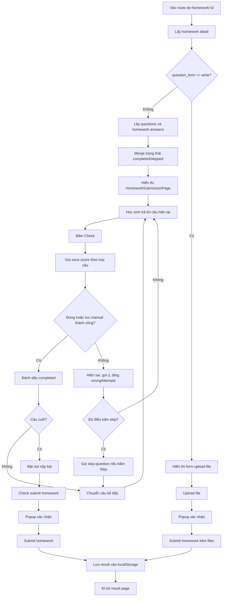

# Luồng làm bài tập về nhà

Status: needs-review
Owner: DEV/TEST
Last reviewed: 2026-09-11
Source: Đọc từ luồng FE hiện có, ưu tiên xác minh lại với code trước khi dùng làm nguồn nghiệp vụ cuối cùng.
Related:
  - docs/requirements/learning-materials/homework.md
  - docs/api/learning-materials/homework.md
  - src/app/[locale]/manage/assignments/do-homework/[id]/page.tsx

Tài liệu này mô tả luồng làm một bài tập về nhà trong FE, dựa trên màn hình dùng chung tại `src/app/[locale]/manage/assignments/do-homework/[id]/page.tsx`.

## Entry point

Các route sau import lại cùng một page xử lý:

- `/{locale}/student/assignments/do-homework/{id}`
- `/{locale}/teacher/assignments/do-homework/{id}`
- `/{locale}/admin/assignments/do-homework/{id}`
- `/{locale}/manage/assignments/do-homework/{id}`

Query params thường dùng:

- `lessonId`: bắt buộc cho các API lưu điểm, skip và nộp bài.
- `from`: nguồn mở bài, dùng để điều hướng sau khi nộp.
- `courseId`, `week`: giữ ngữ cảnh quay lại màn danh sách/bài học.
- `name`: fallback tên bài nếu API chưa trả về tên.

## Khởi tạo màn làm bài

Khi vào page, FE lấy dữ liệu theo thứ tự logic:

1. Gọi `homeWorkApi.getHomeworkDetail` với `id`.
2. Nếu `question_form !== 'write'`, page chạy thêm hai query cho bài dạng câu hỏi:
   - `questionApi.getQuestions` với `homework_id` để lấy danh sách câu.
   - `examAnswerApi.getHomeworkAnswersByStudent` với `homework_id` và `lesson_id` để lấy trạng thái/đáp án đã làm.

Lý do hai query đều có cùng điều kiện: bài dạng `write` chỉ upload file, không cần load danh sách câu hỏi và cũng không cần load answer theo từng câu.

Sau khi có dữ liệu:

- `questions` lấy từ `questionsResponse.questions`.
- Trạng thái hoàn thành từng câu được merge từ `answersRes.questions[].is_completed`.
- Danh sách câu đã skip lấy từ `answersRes.skipped_question_ids`.
- Tên bài lấy từ `homeworkDetail.name`, fallback về query `name`.
- Câu bắt đầu là câu sau câu hoàn thành gần nhất; nếu không có thì bắt đầu từ câu đầu.

## Hai loại bài

### Bài dạng câu hỏi

Điều kiện: `homeworkDetail.question_form !== 'write'`.

UI chính dùng `HomeworkSubmissionPage`, có:

- danh sách câu hỏi;
- câu hiện tại;
- nút kiểm tra đáp án;
- nút skip nếu đủ điều kiện;
- nút nộp bài khi đã tới cuối luồng;
- feedback đúng/sai và gợi ý.

### Bài dạng upload file

Điều kiện: `homeworkDetail.question_form === 'write'`.

UI cho phép học sinh upload file theo `homeworkDetail.question_files`. Nút `Submit` chỉ bật khi có ít nhất một file đã upload. Khi nộp, request gửi `files` gồm `{ type, url }`.

## Cập nhật đáp án trong FE

Mỗi component câu hỏi gọi `handleAnswerUpdate(answer)`. FE lưu đáp án tạm trong:

```ts
answers[currentQuestion.id] = answer
```

Dữ liệu này chỉ là state client. Điểm/trạng thái thật được ghi khi bấm kiểm tra hoặc nộp.

## Kiểm tra câu hỏi

Khi bấm kiểm tra, `handleCheck` chạy các bước:

1. Chặn nếu thiếu `currentQuestion`, đang check, thiếu `lessonId`, hoặc chưa có đáp án.
2. Convert đáp án trong UI sang payload API theo từng loại câu.
3. Gọi API lưu điểm hoặc lưu đáp án.
4. Hiển thị feedback đúng/sai.
5. Nếu đúng hoặc lưu manual thành công, đánh dấu câu hoàn thành và chuyển câu sau sau khoảng 2 giây.
6. Nếu sai, phát âm thanh sai, hiện gợi ý kế tiếp, tăng số lần sai cho câu tự động chấm.

Mapping API theo loại câu:

| Loại câu | API | Payload chính |
| --- | --- | --- |
| `multiple_choice` | `POST /study/save-score/multiple-choice` | `answer_ids` |
| `fill_in_blanks` | `POST /study/save-score/fill-in-blank` | `answers: { position: text }` |
| `ordering` | `POST /study/save-score/ordering-and-dragdrop` | `answers: { sort_position: group_position }` |
| `drag_drop` | `POST /study/save-score/ordering-and-dragdrop` | `answers: { sort_position: group_position }` |
| `matching` | `POST /study/save-score/matching` | `answers: { source_id: target_id }` |
| `category` | `POST /study/save-score/category` | `answers: { answer_id: group_id }` |
| `labeling` | `POST /study/save-score/labeling` | `answers: { blank_id: label_id }` |
| `writing` | `POST /study/save-answer/manual-scoring` | `answer`, `file_url: ''` |
| `speaking` | `POST /study/save-answer/manual-scoring` | `answer: ''`, `file_url` |

Với `writing` và `speaking`, API thành công được coi là hoàn thành câu, còn điểm sẽ do giáo viên chấm sau.

## Sai, gợi ý và skip

FE theo dõi số lần sai bằng `wrongAttempts[questionId]`.

### Xem gợi ý

Khi câu trả lời sai, `handleIncorrectFromAPI` gọi `revealNextHint(currentQuestion)`.

Luồng gợi ý:

1. Lấy danh sách gợi ý từ `currentQuestion.suggests`.
2. Tăng vòng gợi ý trong `hintCycles[questionId]`.
3. Set `activeHint` gồm `questionId` và `hintIndex`.
4. `renderHintOverlay()` hiển thị overlay gợi ý ở phần bottom overlay của `HomeworkSubmissionPage`.

Nội dung gợi ý hỗ trợ:

- `currentHint.text`: render bằng `TiptapMathViewer`.
- `currentHint.file_urls`: render media bằng `MediaDisplay`; ảnh/audio/video được đoán theo đuôi file.
- Nếu không có text và file, hiển thị trạng thái chưa có nội dung gợi ý.

Mỗi lần sai tiếp theo sẽ chuyển sang gợi ý kế tiếp. Nếu hết danh sách gợi ý, index quay vòng theo modulo.

Nút `Đã hiểu` sẽ:

- set `activeHint` về `null`;
- tắt panel đáp án đúng bằng `setShowCorrectAnswerPanel(false)`.

### Xem đáp án đúng

Panel đáp án đúng nằm trong cùng overlay với gợi ý, nhưng chỉ hiện khi đủ điều kiện:

- đang có `currentHint`;
- câu hiện tại không phải `writing`;
- câu hiện tại không phải `speaking`;
- `wrongAttempts[currentQuestion.id] >= 2`.

Khi đủ điều kiện, FE hiển thị nút `Xem đáp án đúng`. Nút này toggle `showCorrectAnswerPanel`.

Nguồn đáp án đúng:

1. Ưu tiên `answersRes.questions[].correct_answers` theo `currentQuestion.id`.
2. Nếu không có, fallback về `currentQuestion.correct_answers`.

`renderCorrectAnswerContent()` render đáp án đúng theo từng loại câu:

| Loại câu | Cách hiển thị đáp án đúng |
| --- | --- |
| `multiple_choice` | Lọc option có `is_correct` hoặc id nằm trong `correct_answers.ids`. |
| `fill_in_blanks` | Sắp xếp option theo `correct_position` và hiển thị từng ô trống. |
| `drag_drop` | Giống `fill_in_blanks`, dựa trên `correct_position`. |
| `ordering` | Sắp xếp đáp án theo `correct_position`. |
| `matching` | Ghép `sources` và `targets` theo `correct_answers.list`. |
| `labeling` | Hiển thị ảnh câu hỏi, vùng blank và danh sách label. |
| `category` | Nhóm item theo category dựa trên `correct_answers.list` hoặc `group_position`. |
| `writing`, `speaking` | Không render đáp án đúng. |

Panel đáp án đúng tự reset về trạng thái ẩn khi đổi câu hỏi hoặc đổi gợi ý.

Một câu có thể skip khi:

- loại câu là `speaking` hoặc `writing`; hoặc
- câu đã sai ít nhất 3 lần; hoặc
- câu nằm trong `skippableQuestions`.

Khi skip:

1. Gọi `POST /study/save-score/skip-question` với `homework_id`, `lesson_id`, `question_id`.
2. Thêm câu vào `skippableQuestions`.
3. Nếu chưa phải câu cuối, chuyển sang câu kế tiếp.
4. Nếu là câu cuối, chuyển sang trang kết quả.

## Nộp bài

Khi bấm nộp, `handleFinishHomework` chạy:

### Với bài upload file

1. Kiểm tra có `lessonId`.
2. Mở popup xác nhận.
3. Khi xác nhận, lọc file hợp lệ: có `url`, không `isUploading`.
4. Gửi `POST /study/save-score/submit-homework` với:

```ts
{
  homework_id,
  lesson_id,
  files: [{ type, url }]
}
```

### Với bài dạng câu hỏi

1. Nếu có `lessonId`, gọi `GET /study/save-score/check-submit-homework`.
2. API trả về:
   - `skipped_count`
   - `skipped_question_ids`
   - `not_completed_count`
3. FE hiển thị popup xác nhận. Nếu học sinh chọn xem lại, FE nhảy về câu skip đầu tiên hoặc câu đầu tiên để review.
4. Nếu xác nhận, gửi `POST /study/save-score/submit-homework` với:

```ts
{
  homework_id,
  lesson_id
}
```

## Sau khi nộp

API nộp bài có thể trả:

- `ratio`: tỷ lệ đúng.
- `completion_rate`: tỷ lệ hoàn thành.
- `star`, `exp`: thưởng nhận được.
- `total_star`, `total_exp`: tổng thưởng sau khi cộng.
- `has_manual_scoring`: có câu cần giáo viên chấm.

FE lưu các giá trị này vào `localStorageHelper` theo key:

- `homework_{homeworkId}_ratio`
- `homework_{homeworkId}_completion_rate`
- `homework_{homeworkId}_star`
- `homework_{homeworkId}_exp`
- `homework_{homeworkId}_total_star`
- `homework_{homeworkId}_total_exp`

Sau đó điều hướng tới trang kết quả:

- Student: `/{locale}/student/assignments/do-homework/{id}/result`
- Role khác: route result theo `resultHomeworkRoute(user, homeworkId)`

Các query `from`, `courseId`, `lessonId`, `week`, `has_manual_scoring` được giữ lại khi cần.

## Trang kết quả

Trang student result nằm tại `src/app/[locale]/student/assignments/do-homework/[id]/result/page.tsx`.

Khi load:

1. Đọc điểm, tỷ lệ hoàn thành, thưởng từ `localStorageHelper`.
2. Xóa các key đã đọc để tránh giữ dữ liệu cũ.
3. Hiển thị tỷ lệ hoàn thành, tỷ lệ đúng, sao và exp.
4. Nếu có `has_manual_scoring=true`, hiển thị thông báo giáo viên sẽ chấm sau.
5. Nút hoàn thành điều hướng theo nguồn:
   - `from=lesson-detail`: quay về lesson detail tab homework.
   - `from=progress-report`: quay về progress report.
   - mặc định: quay về assignments.

## Mermaid flow


