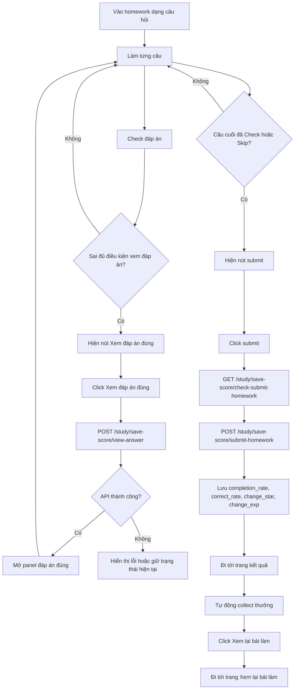

# Thay đổi luồng làm homework dạng câu hỏi

Status: needs-review
Owner: DEV/TEST
Last reviewed: 2026-09-11
Source: Ghi chú thay đổi luồng FE; cần đối chiếu code và API hiện tại trước khi triển khai tiếp.
Related:
  - docs/requirements/learning-materials/homework-flow.md
  - docs/requirements/learning-materials/homework.md
  - docs/api/dashboards/dashboard.md
  - src/app/[locale]/manage/assignments/do-homework/[id]/page.tsx

Tài liệu này mô tả các thay đổi cần áp dụng cho luồng làm homework khi:

```ts
homeworkDetail.question_form !== 'write'
```

Phạm vi này chỉ áp dụng cho bài homework dạng câu hỏi. Bài `write` upload file không nằm trong tài liệu này.

## 0. API lấy chi tiết homework khi làm bài

Luồng homework dạng câu hỏi không dùng API cũ:

```http
GET /study/student/homework-answers
```

Thay vào đó, FE dùng API mới:

```http
GET /dashboard/student/homework-detail
```

Query params:

| Param                | Bắt buộc | Ghi chú                                                                                       |
| -------------------- | -------- | --------------------------------------------------------------------------------------------- |
| `homework_id`        | Có       | ID homework hiện tại.                                                                         |
| `lesson_id`          | Có       | ID lesson hiện tại.                                                                           |
| `batch`              | Không    | Truyền khi URL có batch hoặc khi cần xem/làm theo lượt cụ thể.                                |
| `get_history_answer` | Có       | Luôn truyền `true` ở trang `do-homework` để lấy lịch sử câu trả lời phục vụ làm tiếp/làm lại. |

Ở trang `do-homework`, FE luôn gọi:

```ts
dashboardApi.getStudentHomeworkDetail.useQuery({
  variables: {
    homework_id: Number(homeworkId),
    lesson_id: Number(lessonId),
    batch,
    get_history_answer: true
  }
})
```

Response:

```json
{
  "homework_id": "string | number",
  "batch": 0,
  "is_submitted": false,
  "questions": [
    {
      "question": {},
      "is_answered": true,
      "has_correct": true,
      "question_status": "correct | need_improve | failure | skip | marked | waiting_review | ''",
      "max_star": 5,
      "max_exp": 100,
      "sent_times": [
        {
          "id": "string | number",
          "question_id": "string | number",
          "number_time_sent": 0,
          "is_all_correct": true,
          "ratio_score": 0,
          "star": 0,
          "is_see_answer": true,
          "is_skip": true,
          "batch": 0,
          "answer_data": "string | object | array"
        }
      ]
    }
  ]
}
```

FE parse dữ liệu như sau:

1. `questions[].question` là object câu hỏi theo cấu trúc `QuestionType`.
2. `questions[].sent_times` là lịch sử/lượt làm của câu hỏi; field này có thể vắng mặt hoặc rỗng.
3. Với nhiều `sent_times` trong cùng câu:
   - ưu tiên record có `batch` khớp response `batch`;
   - nếu không có record khớp batch, dùng record cuối cùng trong mảng.
4. `question_status === "correct"` hoặc `question_status === "need_improve"` hoặc `question_status === "marked"` => câu được xem là hoàn thành (`is_completed = true`) để đưa vào `completedQuestions`.
   - `question_status === "correct"`: hiển thị message `This question has been completed.`
   - `question_status === "need_improve"`: hiển thị message `This question needs improvement.`
   - `question_status === "marked"`: câu đã được giáo viên chấm, xem như hoàn thành.
5. `sent_time.is_skip === true` => câu được xem là đã skip.
6. `sent_time.is_see_answer === true` => câu đã xem đáp án đúng.
7. `sent_time.answer_data` có thể là JSON string, object hoặc array chứa dữ liệu đáp án học sinh; parse/chuẩn hóa khi cần hiển thị lại đáp án hoặc dựng state câu đã làm.
8. `correct_answers` lấy từ `question.correct_answers`.

### Quy tắc hiển thị đáp án theo `is_submitted` và `question_status`

Khi render câu hỏi từ response `/dashboard/student/homework-detail`, FE quyết định nguồn đáp án hiển thị theo ma trận sau:

| `is_submitted` | `question.question_status`    | Hiển thị                                                                  |
| -------------- | ----------------------------- | ------------------------------------------------------------------------- |
| Bất kỳ         | Rỗng hoặc không có giá trị    | Đáp án default như luồng làm bài bình thường.                             |
| `false`        | `correct` hoặc `need_improve` | Đáp án đúng từ `question.correct_answers`.                                |
| `false`        | `failure`                     | Đáp án gần nhất của học sinh từ record `sent_times` được chọn theo batch. |
| `false`        | `skip`                        | Đáp án default như luồng làm bài bình thường.                             |
| `true`         | `correct`                     | Đáp án đúng từ `question.correct_answers`.                                |
| `true`         | Khác `correct`                | Đáp án default như luồng làm bài bình thường.                             |

Ghi chú triển khai:

- `question_status` rỗng luôn được xem là default, không suy luận từ `has_correct`.
- Với `failure`, FE không hiển thị đáp án đúng; chỉ tạo lại `userAnswer` từ `sent_times.answer_data` nếu parse được.
- Với `is_submitted = true`, chỉ status `correct` được phép hiển thị đáp án đúng.

### Quy tắc bật nút `Check` theo `is_submitted` và `question_status`

Nút `Check` vẫn phải thỏa điều kiện đáp án hợp lệ của từng dạng câu hỏi. Ngoài điều kiện đó, FE áp dụng thêm rule theo status:

| `is_submitted` | `question.question_status`       | Nút `Check`                    |
| -------------- | -------------------------------- | ------------------------------ |
| `true`         | `correct`                        | Tắt                            |
| `true`         | Khác `correct`                   | Bật nếu đáp án hiện tại hợp lệ |
| `false`        | `correct` hoặc `need_improve`    | Tắt                            |
| `false`        | Khác `correct` và `need_improve` | Bật nếu đáp án hiện tại hợp lệ |

Ghi chú:

- `completedQuestions` vẫn gồm `correct` và `need_improve` để điều hướng Next.
- Không dùng `completedQuestions` để khóa nút `Check`; nút `Check` phải khóa/mở theo bảng trên.
- Trong cùng phiên làm bài, FE dùng local override status sau mỗi thao tác vì `question_status` từ `getStudentHomeworkDetail` là snapshot ban đầu:
  - check đúng: override `correct`;
  - check sai: override `failure`;
  - skip: override `skip`.
- Xem đáp án đúng chỉ gọi API ghi nhận và mở panel đáp án, không đổi local status và không mark completed.
- Riêng `writing` và `speaking` là dạng chấm/lưu thủ công. Sau khi lưu thành công, câu có thể đang ở local status `correct`; tuy nhiên nếu học sinh quay lại câu đó và thay đổi nội dung bài viết hoặc file ghi âm so với lần `Check` gần nhất, nút `Check` phải bật lại để lưu bản mới.
- FE dùng `lastCheckedAnswers` để so sánh câu trả lời hiện tại với câu trả lời đã gửi thành công gần nhất:
  - `writing`: so sánh nội dung text sau khi `trim`.
  - `speaking`: so sánh `fileUrl` của bản ghi âm.
- Với `writing`, khi quay lại câu đã làm trong cùng phiên, UI ưu tiên hiển thị nội dung đang có trong local answer state trước; chỉ fallback về `sent_times.answer_data` khi phiên hiện tại chưa có answer. Điều này tránh việc sau khi sửa và `Check` lại, quay về câu cũ vẫn thấy nội dung của lần gửi trước từ snapshot server.
- Local `is_completed` trong state `questions` cũng cập nhật theo status override: `correct`/`need_improve`/`marked` là completed, `failure`/`skip`/`waiting_review` là chưa completed.

Các phần đang phụ thuộc API cũ cần đổi sang dữ liệu mới:

| Logic hiện tại                | Nguồn cũ                                                                        | Nguồn mới                                                      |
| ----------------------------- | ------------------------------------------------------------------------------- | -------------------------------------------------------------- |
| Danh sách câu hỏi             | `questionApi.getQuestions`                                                      | `questions[].question` từ `/dashboard/student/homework-detail` |
| Trạng thái hoàn thành         | `answersRes.questions[].is_completed`                                           | `question_status === "correct"` hoặc `"need_improve"` hoặc `"marked"` |
| Câu đã skip                   | `answersRes.skipped_question_ids`                                               | `sent_time.is_skip`                                            |
| Đáp án đúng để render panel   | `answersRes.questions[].correct_answers` hoặc `currentQuestion.correct_answers` | `question.correct_answers`                                     |
| Đáp án học sinh/manual answer | `answersRes.manual_answers` hoặc dữ liệu answer cũ                              | `sent_time.answer_data`                                        |

## 1. Nút Xem đáp án

Đáp án đúng được render từ dữ liệu có sẵn trong FE (`question.correct_answers`/`currentQuestion.correct_answers`).

Thay đổi mới: khi học sinh bấm nút `Xem đáp án đúng`, FE cần gọi API ghi nhận hành động xem đáp án.

Endpoint:

```http
POST /study/save-score/view-answer
```

Request:

```json
{
  "homework_id": "string",
  "question_id": "string",
  "lesson_id": "string"
}
```

Luồng đề xuất:

1. Học sinh trả lời sai đủ điều kiện hiện panel đáp án đúng.
2. FE hiển thị nút `Xem đáp án đúng`.
3. Khi click nút, FE gọi `POST /study/save-score/view-answer`.
4. Nếu API thành công, FE mở panel đáp án đúng.
5. Nếu API lỗi, FE hiển thị lỗi và không mở panel, hoặc giữ trạng thái hiện tại theo UX cuối cùng.

Ghi chú:

- API này chỉ nên gọi khi user chủ động bấm `Xem đáp án đúng`.
- Không gọi API khi chỉ render hint.
- Không áp dụng cho `writing` và `speaking`.

## 1.1. Hint cho `writing` và `speaking`

Với `writing` và `speaking`, nếu backend trả `question.expect_answer`, UI dùng `suggests` và `expect_answer` để render phần đáp án mẫu trong hint, không dùng `correct_answer` cho 2 dạng này.

Logic hint của 2 dạng manual question đã đổi như sau:

1. Bỏ logic tự động hiện hint khi lưu/chấm thủ công thất bại.
   - Trước đây, khi `saveScoreManual` trả lỗi/thất bại cho `writing` hoặc `speaking`, FE đi qua `handleIncorrectFromAPI(false)` và vẫn có thể gọi `revealNextHint(currentQuestion)`.
   - Hiện tại, `handleIncorrectFromAPI(false)` không tự động gọi `revealNextHint` nữa.
   - Lỗi API chỉ hiển thị feedback lỗi/sai và reset feedback theo flow hiện tại; hint không tự bật.
2. Thêm thao tác hint chủ động trên UI cho `writing` và `speaking`.
   - `HomeworkSubmissionPage` nhận prop `onShowHint`.
   - Header câu hỏi hiển thị icon hint khi và chỉ khi:
     - `currentQuestion.type === "writing"` hoặc `currentQuestion.type === "speaking"`;
     - `currentQuestion.suggests` có ít nhất 1 item.
   - Nếu câu không có `suggests`, icon hint bị ẩn.
3. Khi học sinh click icon hint:
   - FE gọi `handleShowManualHint` trong trang `do-homework`.
   - Handler chỉ cho phép mở hint với `writing`/`speaking`.
   - Handler set `activeHint` cho câu hiện tại, mặc định dùng hint đầu tiên (`hintIndex = 0`).
   - Handler đóng panel đáp án đúng nếu panel đang mở.
4. Overlay hint vẫn dùng `HomeworkHintOverlay` và render qua `bottomOverlayContent`.
5. `HomeworkHintOverlay` không dùng `correct_answer` cho `writing` và `speaking`. Nếu câu có `expect_answer`, overlay hiển thị panel `Đáp án mẫu`; nếu không có `expect_answer`, chỉ hiển thị phần gợi ý.

## 2. Response check-submit homework

API kiểm tra trước khi nộp bài:

```http
GET /study/save-score/check-submit-homework
```

Query params:

| Param         | Bắt buộc | Ghi chú               |
| ------------- | -------- | --------------------- |
| `homework_id` | Có       | ID homework hiện tại. |
| `lesson_id`   | Có       | ID lesson hiện tại.   |

Response mới:

```json
{
  "homework_id": "8223",
  "user_id": "19865",
  "skipped_count": "0",
  "skipped_question_ids": [],
  "failure_count": "0",
  "failure_question_ids": [],
  "missing_count": "1"
}
```

Mapping FE:

| Field                  | Ý nghĩa                           | FE dùng                                                                    |
| ---------------------- | --------------------------------- | -------------------------------------------------------------------------- |
| `skipped_count`        | Số câu đã skip.                   | Hiển thị trong popup xác nhận.                                             |
| `skipped_question_ids` | Danh sách ID câu đã skip.         | Khi user chọn xem lại, ưu tiên nhảy tới câu skip đầu tiên.                 |
| `failure_count`        | Số câu sai/cần làm lại.           | Cộng vào tổng câu chưa hoàn tất.                                           |
| `failure_question_ids` | Danh sách ID câu sai/cần làm lại. | Nếu không có câu skip, user chọn xem lại sẽ nhảy tới câu failure đầu tiên. |
| `missing_count`        | Số câu chưa làm/chưa có answer.   | Cộng vào tổng câu chưa hoàn tất.                                           |

FE không còn dùng `not_completed_count` từ API. Thay vào đó, FE tính:

```ts
notCompletedCount = skipped_count + failure_count + missing_count
```

## 3. UX hiển thị nút Submit trên trang làm bài

Nút submit/nộp bài không hiển thị cố định trong toàn bộ quá trình làm bài.

Logic mới:

1. Khi học sinh chưa ở câu cuối cùng, không hiển thị nút submit.
2. Khi học sinh ở câu cuối cùng nhưng chưa bấm `Check` hoặc `Skip` cho câu cuối cùng, không hiển thị nút submit.
3. Khi học sinh ở câu cuối cùng và bấm `Check` hoặc `Skip` cho câu cuối cùng, bắt đầu hiển thị nút submit.
4. Nếu học sinh đang ở câu cuối cùng và câu cuối cùng đã có `question_status === "correct"` từ response hoặc local status, hiển thị nút submit ngay mà không cần bấm lại `Check` hoặc `Skip`.
5. Sau khi nút submit đã hiển thị, giữ trạng thái hiển thị để học sinh có thể nộp bài.

Ghi chú triển khai:

- "Câu cuối cùng" được xác định theo index cuối trong danh sách câu hỏi đang render.
- `Check` và `Skip` ở câu cuối cùng chỉ bật nút submit; không tự điều hướng sang trang kết quả.
- Logic này chỉ điều khiển hiển thị nút submit, không thay thế API `check-submit-homework`.
- Khi user bấm submit, FE vẫn gọi `GET /study/save-score/check-submit-homework` trước khi nộp bài theo logic ở mục response check-submit.

## 4. Response nộp homework

API nộp bài:

```http
POST /study/save-score/submit-homework
```

Response mới:

```json
{
  "homework_id": "string",
  "user_id": "string",
  "score": 0,
  "ratio": 0,
  "has_manual_scoring": true,
  "has_questions_need_manual_grading": true,
  "files": [
    {
      "type": "string",
      "url": "string"
    }
  ],
  "star": 0,
  "is_completed": true,
  "exp": 0,
  "total_exp": 0,
  "total_star": "string",
  "change_exp": 0,
  "change_star": "string",
  "completion_rate": 0,
  "correct_rate": 0
}
```

Các field FE cần dùng cho trang kết quả:

| Field                               | Ý nghĩa                                  |
| ----------------------------------- | ---------------------------------------- |
| `completion_rate`                   | Tỷ lệ hoàn thành bài.                    |
| `correct_rate`                      | Tỷ lệ làm đúng.                          |
| `change_star`                       | Số star nhận được trong lần nộp này.     |
| `change_exp`                        | Số exp nhận được trong lần nộp này.      |
| `total_star`                        | Tổng star sau khi cộng thưởng.           |
| `total_exp`                         | Tổng exp sau khi cộng thưởng.            |
| `has_manual_scoring`                | Bài có phần cần giáo viên chấm thủ công. |
| `has_questions_need_manual_grading` | Có câu hỏi cần giáo viên chấm thủ công.  |
| `is_completed`                      | Trạng thái hoàn thành homework.          |

Lưu ý mapping hiển thị:

- Tỷ lệ hoàn thành: dùng `completion_rate`.
- Tỷ lệ làm đúng: dùng `correct_rate`, không dùng `ratio` nếu backend đã chuẩn hóa field mới.
- Star nhận được: dùng `change_star`.
- Exp nhận được: dùng `change_exp`.

## 4.1. Loading khi submit final

Khi user confirm nộp bài, FE cần hiển thị trạng thái loading trong lúc gọi API:

```http
POST /study/save-score/submit-homework
```

Thay đổi trong trang `do-homework`:

1. Thêm state `isSubmittingFinal`.
2. Khi `handleConfirmSubmit` bắt đầu:
   - nếu `isSubmittingFinal === true` thì return để chặn submit lặp;
   - set `isSubmittingFinal = true`;
   - giữ confirm dialog đang mở để user thấy trạng thái đang nộp;
   - clear `apiErrorMessage` cũ.
3. `HomeworkConfirmDialog` nhận prop `isSubmitting`:
   - disable nút hủy/review;
   - disable nút confirm;
   - hiện spinner trên nút confirm;
   - đổi text confirm thành `Đang nộp...`.
4. Nếu validation file của `question_form === "write"` thất bại, reset `isSubmittingFinal = false` và hiển thị lại lỗi trong dialog.
5. Nếu API submit lỗi, reset `isSubmittingFinal = false` để user có thể thao tác lại.
6. Nếu API submit thành công, FE điều hướng sang trang kết quả; không cần reset local loading state.
7. `HomeworkWriteSubmissionView` cũng nhận `isSubmitting` để disable nút Submit của form upload file riêng và truyền loading vào confirm dialog dùng chung.

## 5. Trang kết quả

Trang kết quả sau khi nộp homework cần thay đổi UI/logic.

### Dữ liệu hiển thị

Hiển thị các chỉ số:

- Tỷ lệ hoàn thành: `completion_rate`.
- Tỷ lệ làm đúng: `correct_rate`.
- Star nhận được: `change_star`.
- Exp nhận được: `change_exp`.

### Thu thập phần thưởng

Thay đổi mới:

- Phần thưởng tự động collect khi vào màn kết quả.
- User không cần bấm nút `Thu thập`.
- Animation cộng star/exp có thể chạy tự động sau khi trang load.
- Không hiển thị nút `Thu thập`.

### Nút hành động

Trang kết quả chỉ còn 1 nút:

```text
Xem lại bài làm
```

Khi click:

1. FE điều hướng tới trang `Xem lại bài làm`.
2. Trang `Xem lại bài làm` là trang mới.
3. Chi tiết route, data source và UI của trang này sẽ được bổ sung sau.

## 6. Trang Xem lại bài làm

Trang `Xem lại bài làm` đã có tài liệu riêng tại:

```txt
docs/requirements/learning-materials/homework-review-page.md
```

Route hiện tại:

```txt
/{locale}/student/assignments/do-homework/{homeworkId}/review
```

Trang review dùng `GET /dashboard/student/homework-detail` với `get_history_answer = false`.

Từ trang review, nút `Làm lại các câu chưa đúng` gọi `POST /study/save-score/batches`, lấy `current_batch` từ response và route về trang `do-homework` với query `batch={current_batch}`. Số câu cần làm lại tính cả `waiting_review`; `marked` không tính vì được xem là đã hoàn tất.

## 7. Luồng tổng quát sau thay đổi


