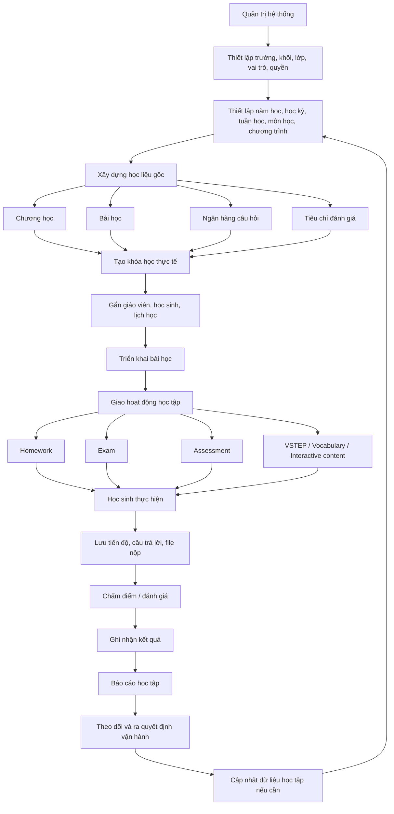
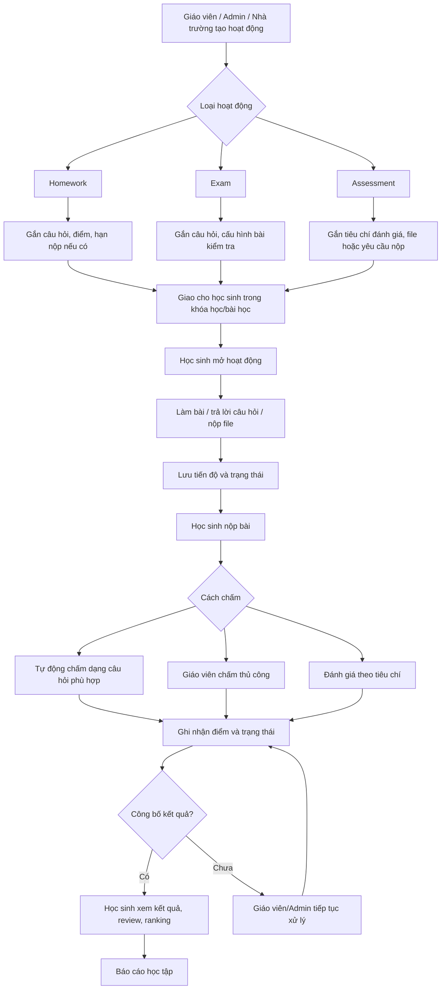
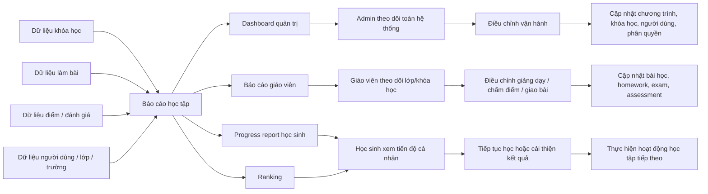

# LMS Business Flow Overview

Status: reviewed
Owner: BA/DEV
Last reviewed: 2026-09-16
Source: Tổng hợp từ `docs/requirements/overview.md` và các tài liệu domain liên quan.
Related:
  - docs/requirements/overview.md
  - docs/requirements/auth/auth.md
  - docs/requirements/programs/program.md
  - docs/requirements/programs/course.md
  - docs/requirements/learning-materials/homework.md
  - docs/requirements/learning-materials/exam.md
  - docs/requirements/learning-materials/assessment.md
  - docs/requirements/reports/student-progress-ranking.md
  - docs/security/overview.md
  - docs/api/overview.md

Review note: Flow tổng quan đã được xác nhận đúng. Hiện không có module nào trong flow này cần ghi là tạm ẩn hoặc không sử dụng, ngoài các chức năng đã được ghi riêng ở tài liệu domain như Chat/Contest. Ranking chính thức dùng phạm vi course.

Tài liệu này mô tả flow nghiệp vụ tổng quan của LMS ở mức hệ thống. Flow này dùng để định hướng BA/DEV/TEST/AI khi cần hiểu chuỗi nghiệp vụ chính, không thay thế tài liệu chi tiết của từng domain.

## 1. Flow tổng quan theo vai trò

```mermaid
flowchart LR
  A[Người dùng truy cập hệ thống] --> B[Xác thực và xác định vai trò]

  B --> C1[Admin]
  B --> C2[Nhà trường]
  B --> C3[Giáo viên]
  B --> C4[Học sinh]
  B --> C5[Phụ huynh]

  C1 --> D1[Quản trị dữ liệu nền toàn hệ thống]
  C2 --> D2[Quản trị dữ liệu trong phạm vi trường]
  C3 --> D3[Tổ chức giảng dạy và theo dõi học sinh]
  C4 --> D4[Tham gia học tập và làm bài]
  C5 --> D5[Xem tài khoản con và chuyển vào tài khoản học sinh]

  D1 --> E[Thiết lập tổ chức học tập]
  D2 --> E
  D3 --> E

  E --> E1[Năm học / học kỳ / tuần học]
  E --> E2[Trường / khối / lớp]
  E1 --> F[Chương trình học]
  E2 --> F
  F --> G[Khóa học triển khai thực tế]
  G --> H[Chương học và bài học]

  H --> I[Học liệu và hoạt động học tập]
  I --> I1[Lecture / Video / Vocabulary / Flipbook]
  I --> I2[Homework]
  I --> I3[Exam]
  I --> I4[Assessment]

  I1 --> J[Học sinh học nội dung]
  I2 --> K[Học sinh làm bài]
  I3 --> K
  I4 --> L[Học sinh nộp minh chứng hoặc được đánh giá]

  K --> M[Chấm điểm tự động hoặc thủ công]
  L --> M

  M --> N[Công bố / ghi nhận kết quả]
  N --> O[Báo cáo tiến độ, kết quả, ranking]
  O --> P[Admin / Nhà trường / Giáo viên theo dõi]
  O --> Q[Học sinh xem kết quả của mình]
  O --> Q2[Phụ huynh theo dõi qua tài khoản con]

  P --> R[Điều chỉnh chương trình, khóa học, bài học hoặc hoạt động]
  Q --> S[Tiếp tục học tập / làm lại / cải thiện kết quả]
  R --> E
  S --> J
```

## 2. Chuỗi nghiệp vụ lõi

## 3. Flow làm bài và đánh giá

## 4. Flow báo cáo và phản hồi vận hành

## 5. Ghi chú đọc flow

- Admin có phạm vi toàn hệ thống; Nhà trường thao tác trong phạm vi dữ liệu của trường.
- Giáo viên là vai trò vận hành giảng dạy: tổ chức bài học, giao/chấm bài và theo dõi kết quả.
- Học sinh là vai trò thực hiện học tập: học nội dung, làm bài, nộp bài và xem kết quả.
- Phụ huynh là vai trò hiện có trong code, có thể xem danh sách tài khoản con và chuyển phiên sang tài khoản học sinh.
- Hệ thống hiện đã có quản lý năm học, học kỳ, tuần học, khối và lớp học; các dữ liệu này là nền vận hành cho khóa học/lịch học/báo cáo.
- Course là lớp triển khai thực tế của program, gắn giáo viên, học sinh, học kỳ/năm học và lịch học.
- Homework, Exam và Assessment là các hoạt động chính tạo dữ liệu tiến độ, điểm và báo cáo trong flow hiện tại.
- Báo cáo là đầu ra của toàn bộ chuỗi học tập, đồng thời là đầu vào để điều chỉnh vận hành.

## 6. Điểm cần theo dõi khi viết đặc tả/test chi tiết

- Phạm vi ranking chính thức hiện tại là theo course.
- Điều kiện công bố kết quả assessment/study report cho học sinh cần đối chiếu ở tài liệu report/assessment chi tiết khi viết test.
- Ranh giới thao tác giữa Admin và Nhà trường ở các module có quyền giống nhau nhưng khác phạm vi dữ liệu cần kiểm tra theo permission/API thực tế.
- Flow chi tiết cho các tích hợp ngoài như PHX, SpeechAce, ELSA, Google hoặc AI grading chỉ cần đưa vào sơ đồ cấp hệ thống khi có yêu cầu triển khai/test các tích hợp đó.
