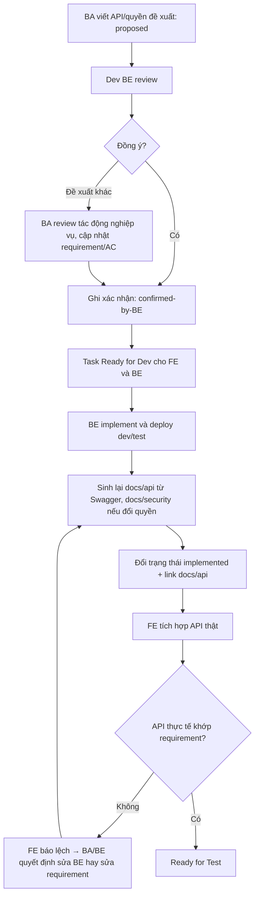

# API Contract Workflow

Status: reviewed
Owner: PM/BA/DEV BE
Last reviewed: 2026-09-16
Related:
  - docs/ai/ba/ba-workflow.md
  - docs/ai/dev/dev-workflow.md
  - docs/ai/ba/templates/feature-requirement.md
  - docs/ai/ba/templates/change-note.md
  - docs/api/overview.md
  - docs/security/overview.md
  - docs/workflows/feature-delivery-workflow.md

## Mục đích

Tài liệu này quy định cách PM/BA, Dev BE và Dev FE chốt API và phân quyền cho một task, và cách cập nhật `docs/api/`, `docs/security/` sau khi BE triển khai.

Bối cảnh:

- Requirement trong repo FE là nguồn chung cho cả Dev FE và Dev BE.
- Code BE nằm ở repo khác; trong repo này Dev BE chỉ làm việc với tài liệu.
- `docs/api/` sinh từ Swagger, `docs/security/` sinh từ dữ liệu phân quyền. Không sửa tay nội dung generated.

## Trách nhiệm

| Việc | Phụ trách | Xác nhận |
| --- | --- | --- |
| Viết API/quyền đề xuất trong requirement (`proposed`) | PM/BA | — |
| Review đề xuất, chốt contract hoặc đề xuất thay đổi | Dev BE | PM/BA (tác động nghiệp vụ) |
| Đổi trạng thái sang `confirmed-by-BE` | PM/BA hoặc Dev BE | Dev BE |
| Cập nhật AC/BR nếu contract chốt khác đề xuất | PM/BA | Dev BE |
| Sinh lại `docs/api/` từ Swagger sau khi BE deploy | PM/BA hoặc Dev BE | Dev BE |
| Sinh lại `docs/security/` khi phân quyền thay đổi | PM/BA hoặc Dev BE | Dev BE |
| Đổi trạng thái sang `implemented`, link `docs/api/` | PM/BA hoặc Dev BE | PM/BA |
| Báo lệch giữa API thực tế và requirement khi tích hợp | Dev FE | PM/BA/Dev BE |

## Trạng thái API và phân quyền đề xuất

| Trạng thái | Ý nghĩa | Dev FE được làm gì |
| --- | --- | --- |
| `proposed` | BA đề xuất, BE chưa xác nhận | Chỉ dựng UI/mock nếu requirement ghi rõ "làm song song"; không coi là contract |
| `confirmed-by-BE` | BE đã chốt endpoint, request, response, lỗi, quyền | Tích hợp theo contract trong requirement, mock nếu BE chưa deploy |
| `implemented` | BE đã deploy lên môi trường dev/test, `docs/api/` đã sinh lại | Tích hợp và test với API thật |
| `changed` | BE đổi contract sau khi đã confirmed | Dừng phần bị ảnh hưởng, chờ BA/BE cập nhật requirement |

Mỗi lần đổi trạng thái, ghi dòng xác nhận ngay dưới API/quyền tương ứng trong requirement:

```text
- Trạng thái: confirmed-by-BE
- Xác nhận: <tên Dev BE>, YYYY-MM-DD, <kênh: ClickUp comment/họp/chat>
- Khác biệt so với đề xuất: <không có | mô tả>
```

## Luồng



## Sinh lại `docs/api/` và `docs/security/`

Hiện repo chưa có script sinh tự động; tài liệu được bóc tách từ file nguồn (thường nhờ AI).

`docs/api/`:

1. Lấy `swagger.json` từ môi trường BE đã deploy (ghi rõ môi trường).
2. Sinh lại file theo domain/tag, giữ cấu trúc hiện có trong `docs/api/overview.md`.
3. Cập nhật metadata: `Status: generated`, `Source: swagger.json (<môi trường>, <ngày>)`, `Generated at`.
4. Kiểm tra diff: chỉ các endpoint liên quan thay đổi; endpoint bị xóa/đổi phải báo BA/FE.
5. Không lưu file `swagger.json` có thông tin nội bộ nhạy cảm vào repo nếu chưa được phép.

`docs/security/`:

1. Lấy response phân quyền (`role_permissions`, `permissions`) từ môi trường BE.
2. Sinh lại `rbac-matrix.md`, `roles/`, `resources/`.
3. Cập nhật `Source` và `Generated at`.
4. Role/quyền mới phải khớp mục "Phân quyền đề xuất" đã `confirmed-by-BE`.

Sau khi sinh lại, thêm dòng vào `docs/requirements/change-log.md` với `Change type = Docs generated`, link task ClickUp liên quan.

## Khi requirement và API thực tế lệch nhau

Theo quy tắc chung, tài liệu được ưu tiên hơn code. Với API:

- Requirement `confirmed-by-BE` là contract. API thực tế lệch → mặc định là lỗi BE, tạo bug/feedback cho BE.
- Nếu BE có lý do kỹ thuật không làm theo contract: Dev BE đề xuất thay đổi, PM/BA review, cập nhật requirement trước, rồi FE mới sửa theo.
- FE không tự đổi logic để "chiều" API lệch contract mà không có cập nhật requirement.
