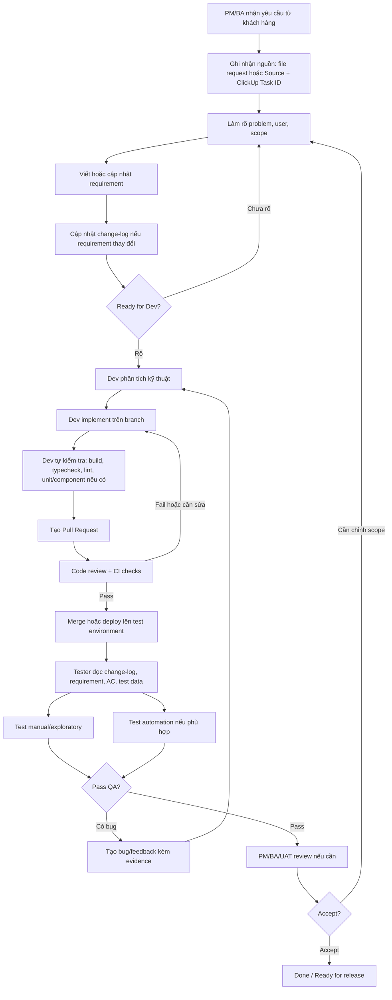
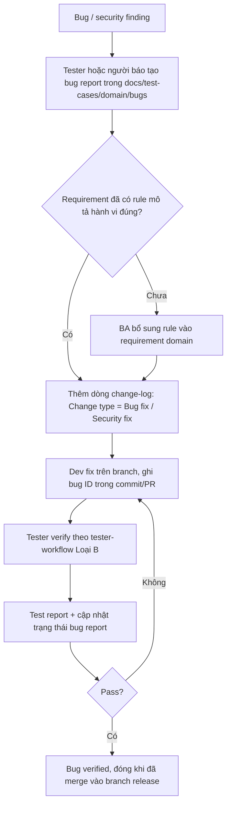

# Feature Delivery Workflow

Status: draft
Owner: PM/BA/DEV/TEST
Related:
  - docs/requirements/change-log.md
  - docs/requirements/change-workflow.md
  - docs/ai/ba/ba-workflow.md
  - docs/ai/dev/dev-workflow.md
  - docs/workflows/api-contract-workflow.md
  - docs/testing/test-automation-workflow.md
  - docs/ai/testing/test-case-generation.md
  - docs/ai/testing/tester-workflow.md
  - docs/test-cases/

## Mục đích

Tài liệu này mô tả luồng đi của một task/chức năng từ PM/BA sang Dev rồi sang Test.

Mục tiêu:

- PM/BA biết cần chuẩn bị requirement ở mức nào trước khi giao Dev.
- Dev biết cần đọc gì, implement gì và bàn giao gì cho Test.
- Tester biết bắt đầu từ đâu, test theo scope nào và phản hồi bug/coverage như thế nào.
- Team có cùng một cách hiểu về `Ready for Dev`, `Ready for Test` và `Done`.

## Sơ đồ tổng quan

## Artifact chính theo từng giai đoạn

| Giai đoạn | Owner chính | Artifact cần có | Người dùng artifact |
| --- | --- | --- | --- |
| Ghi nhận yêu cầu | PM/BA | ClickUp task; file `docs/requirements/requests/` (nếu có minh chứng) hoặc mục `Source` | BA, Dev, Test |
| Làm rõ yêu cầu | PM/BA | Requirement, acceptance criteria, rule/flow, API/quyền đề xuất cho BE, open questions, customer confirmation | Dev FE, Dev BE, Test |
| Theo dõi thay đổi | PM/BA | `docs/requirements/change-log.md` | Dev, Test |
| Thiết kế kỹ thuật | Dev | Ghi chú implementation, API/type/store/component impact | Dev, Reviewer |
| Implement | Dev | Branch/PR, code, test liên quan | Reviewer, Test |
| Review | Dev/Reviewer | PR review, CI result, fix note | Dev, Test |
| Test | TEST | Test case, test evidence, bug report, automation | Dev, PM/BA |
| Chấp nhận | PM/BA/Stakeholder | UAT note, acceptance decision | Team |

## Bước 1: PM/BA làm rõ yêu cầu

Quy trình chi tiết cho PM/BA (kể cả khi dùng AI) nằm trong `docs/ai/ba/ba-workflow.md`: ghi nhận yêu cầu khách hàng, phân loại, template, ClickUp Task ID, Definition of Done trước `Ready for Dev`.

Phân công PM và BA:

- PM: tiếp nhận yêu cầu từ khách, ưu tiên, ước lượng, kế hoạch release. Các thông tin này quản lý trên ClickUp, không bắt buộc ghi trong repo.
- BA: ghi nhận nguồn yêu cầu, làm rõ nghiệp vụ, viết requirement và change-log trong repo.
- Một người có thể kiêm cả hai vai trò.

PM/BA cần làm rõ:

- Người dùng hoặc role nào bị ảnh hưởng.
- Problem cần giải quyết là gì.
- Scope trong task này là gì, ngoài scope là gì.
- Business rule hoặc validation nào thay đổi.
- API/data/permission nào liên quan. Requirement là nguồn chung cho Dev FE và Dev BE, nên API/quyền mới phải ghi ở mục "API đề xuất cho BE" và "Phân quyền đề xuất".
- Acceptance criteria để Dev và Test cùng verify.

Nếu task là thay đổi trên chức năng đã tồn tại:

1. Đọc `docs/requirements/change-workflow.md`.
2. Quyết định sửa file requirement cũ hay tạo file mới.
3. Cập nhật `docs/requirements/change-log.md`.

## Bước 2: Gate Ready for Dev

Một task được xem là `Ready for Dev` khi:

- Có requirement hoặc change note rõ ràng.
- Có acceptance criteria hoặc expected behavior.
- Có role/permission liên quan nếu chức năng phụ thuộc RBAC.
- Có API/data dependency nếu UI phụ thuộc backend.
- Có test impact sơ bộ: `None`, `Manual`, `Regression`, `Automation`, `Regression + Automation` hoặc `Needs review`.
- Không còn open question chặn implementation.
- Có ClickUp Task ID, nguồn yêu cầu và xác nhận phạm vi của khách hàng.
- Nếu cần API/quyền mới: requirement có mục API và phân quyền đề xuất cho BE.

Checklist đầy đủ: "Definition of Done trước khi Ready for Dev" trong `docs/ai/ba/ba-workflow.md`.

Nếu chưa đạt, task quay lại PM/BA để làm rõ.

## Bước 3: Dev phân tích và implement

Quy trình chi tiết cho Dev FE/BE (kể cả khi dùng AI) nằm trong `docs/ai/dev/dev-workflow.md`: điều kiện bắt đầu, tự kiểm tra, template PR, tài liệu cần cập nhật, Definition of Done.

API và phân quyền được chốt giữa PM/BA, Dev BE và Dev FE theo `docs/workflows/api-contract-workflow.md` (trạng thái `proposed` → `confirmed-by-BE` → `implemented`). PM/BA/Dev BE phụ trách xác nhận contract và sinh lại `docs/api/`, `docs/security/` sau khi BE deploy.

Dev FE cần đọc theo thứ tự:

1. `AGENTS.md`.
2. Requirement hoặc change note được link từ task.
3. `docs/requirements/change-log.md` nếu task là thay đổi requirement.
4. Route/page entry trong `src/app/`.
5. Feature component trong `src/components/features/`.
6. API/type/store/hook liên quan.
7. Design/security/testing docs nếu requirement link tới.

Dev cần bàn giao:

- Code trên branch/PR, tiêu đề PR có ClickUp Task ID.
- Mô tả PR theo template trong `docs/ai/dev/dev-workflow.md` (Bước 7).
- Ghi chú thay đổi chính trong PR.
- Cách test nhanh cho reviewer/tester.
- Các risk hoặc điểm chưa chắc nếu có.
- Test đã chạy hoặc lý do chưa chạy được.

## Bước 4: Code review và CI

PR nên được review trước khi đưa qua Test chính thức.

Reviewer kiểm tra:

- Code có đúng requirement và acceptance criteria không.
- Có làm vỡ flow/role khác không.
- Có thiếu xử lý loading/empty/error không.
- Có hard-code secret/data không.
- Có cần test unit/component/E2E bổ sung không.

Nếu CI hoặc review fail, task quay lại Dev.

## Bước 5: Gate Ready for Test

Một task được xem là `Ready for Test` khi:

- Code đã deploy lên môi trường test hoặc có hướng dẫn chạy local rõ ràng.
- Requirement/change-log đã phản ánh hành vi cần test.
- Test data/account đã sẵn sàng hoặc có hướng dẫn tạo.
- Dev đã ghi rõ scope thay đổi và risk trong PR/task.
- Không còn lỗi blocker đã biết khiến tester không thể bắt đầu.

Tester không nên bắt đầu automation chính thức nếu requirement còn `Draft` hoặc test data chưa ổn định.

## Bước 6: Test execution

Tester cần bắt đầu từ:

1. `docs/requirements/change-log.md` để biết file requirement nào đổi.
2. Requirement hoặc change note liên quan.
3. Acceptance criteria trên task/PR.
4. `docs/testing/environments.md`.
5. `docs/testing/test-data.md`.
6. Test case hiện có trong `docs/test-cases/`.
7. Test automation workflow nếu cần automation.

Tester thực hiện:

- Test happy path.
- Test validation.
- Test permission/RBAC nếu có.
- Test loading/empty/error state nếu có.
- Regression các flow bị ảnh hưởng.
- Automation nếu `Test impact` yêu cầu.

Vai trò Tester (người hoặc AI) không sửa source code sản phẩm. Chi tiết phân loại task, output bắt buộc và Definition of Done cho Tester nằm trong `docs/ai/testing/tester-workflow.md`.

## Bước 7: Bug/feedback loop

Nếu test fail, tester tạo bug report trong `docs/test-cases/<domain>/bugs/<BUG-ID>.md` (template trong `docs/test-cases/overview.md`) với:

- Task hoặc requirement liên quan.
- Môi trường test.
- Account/role dùng khi test.
- Steps to reproduce.
- Expected result.
- Actual result.
- Screenshot/video/log/trace nếu có.
- Mức độ ảnh hưởng.

Sau đó task quay lại Dev hoặc BA tùy nguyên nhân:

- Sai code so với requirement: quay lại Dev.
- Requirement thiếu/rối/mâu thuẫn: quay lại PM/BA.
- Test data/env lỗi: xử lý môi trường hoặc dữ liệu trước khi kết luận bug sản phẩm.

## Bước 8: PM/BA/UAT accept

PM/BA hoặc stakeholder review khi:

- Đây là feature mới hoặc thay đổi business rule quan trọng.
- Tester pass nhưng cần xác nhận trải nghiệm/nghiệp vụ.
- Có open question được chốt trong quá trình test.

Kết quả nghiệm thu ghi vào mục `Customer confirmation` → `UAT` của requirement/change note (hoặc file request nếu có): người nghiệm thu, ngày, kết quả, phản hồi.

Nếu accept, task chuyển `Done` hoặc `Ready for release` trên ClickUp và trong `docs/requirements/change-log.md`.

Nếu không accept, task quay lại PM/BA để chỉnh scope hoặc quay lại Dev nếu chỉ là lỗi implementation.

## Luồng bug fix và security finding

Bug từ production, báo cáo pentest hoặc security finding không đi qua bước PM/BA viết requirement mới, nhưng vẫn phải để lại dấu vết trong `docs/` để Dev và Tester dùng chung một nguồn.

| Vai trò | Việc cần làm |
| --- | --- |
| Người báo/Tester | Tạo bug report có steps, expected, actual, severity, evidence. |
| BA | Nếu requirement chưa mô tả hành vi đúng, bổ sung rule; thêm dòng `change-log.md`. |
| Dev | Fix, ghi bug ID trong commit/PR, ghi branch chứa fix. |
| Tester | Verify fix, tìm regression/bug liên quan, ghi test report, cập nhật trạng thái bug. |

Bug chỉ được xem là `verified` khi fix đã có trên branch/môi trường tester kiểm tra. Nếu fix chưa merge vào branch chính (ví dụ `develop`), ghi rõ trong test report.

## BMad mapping

Nếu dùng BMad, có thể map workflow như sau. Output của các skill planning (brief, PRD, spec, epics) mặc định ghi vào `_bmad-output/planning-artifacts/` (gitignore); nội dung đã chốt phải chuyển vào `docs/requirements/` theo template trong `docs/ai/ba/templates/`.

| Giai đoạn | BMad skill phù hợp |
| --- | --- |
| Product idea/brief | `bmad-product-brief` hoặc `bmad-prfaq` |
| Requirement/PRD | `bmad-prd` hoặc `bmad-spec` |
| Architecture | `bmad-architecture` |
| Epics/stories | `bmad-create-epics-and-stories` |
| Sprint readiness | `bmad-sprint-planning` |
| Implementation | `bmad-build` |
| Code review | `bmad-code-review` hoặc `bmad-review` |
| Test design | `bmad-testarch-test-design` |
| Test framework | `bmad-testarch-framework` |
| Test automation | `bmad-qa-generate-e2e-tests` hoặc `bmad-testarch-automate` |
| Test review | `bmad-testarch-test-review` |
| Traceability | `bmad-testarch-trace` |
| Retrospective | `bmad-retrospective` |

## Definition of Done

Một task/chức năng được xem là `Done` khi:

- Requirement/acceptance criteria đã được đáp ứng.
- Code đã review và merge theo quy trình team.
- Build/CI quan trọng pass hoặc có exception được chấp nhận.
- Tester đã pass scope test cần thiết.
- Bug blocker/critical không còn mở.
- Test case hoặc automation đã cập nhật nếu có impact.
- Test report và bug report đã được ghi trong `docs/test-cases/<domain>/`.
- Requirement/change-log đã được cập nhật nếu hành vi sản phẩm thay đổi.
- PM/BA/UAT accept nếu task yêu cầu acceptance nghiệp vụ.

## Lưu ý vận hành

- Không để requirement chỉ nằm trong chat hoặc PR description.
- Không chuyển sang Test nếu tester không biết requirement file nào đã đổi.
- Không coi automation là bắt buộc cho mọi task; ưu tiên các flow có giá trị regression cao.
- Nếu code và tài liệu mâu thuẫn, ghi rõ điểm lệch và cần BA/Dev xác nhận trước khi dùng làm tiêu chí test.
